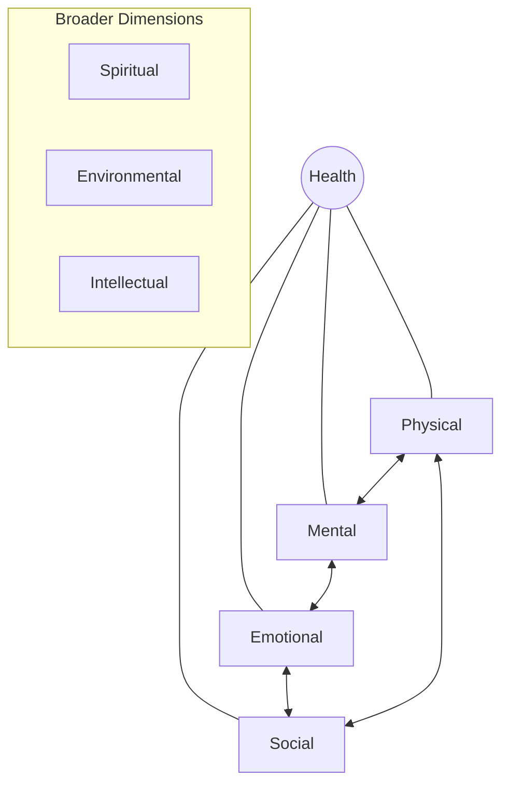

# CUU 1201 Health Awareness and Life Skills: Basic Principles of Health Education

## Key Terminologies
*   **Health**: A state of complete physical, mental, and social well-being, not merely the absence of disease.
*   **Physical Health**: The functional operation of the body, including fitness, nutrition, and sleep.
*   **Mental Health**: Cognitive functioning and the ability to process information and manage thoughts.
*   **Emotional Health**: The ability to understand, manage, and express feelings while coping with stress.
*   **Social Health**: The ability to form meaningful, supportive relationships and maintain effective communication.
*   **Social Determinants of Health (SDOH)**: Non-medical, environmental, and social conditions influencing health risks and outcomes.

---

## 1. Introduction to Health
> [!abstract] WHO Definition of Health
> Health is a state of complete physical, mental, and social well-being, and not merely the absence of disease or infirmity. It comprises interconnected dimensions that define overall quality of life.

### Dimensions of Health
| Dimension | Focus | Key Indicators |
| :--- | :--- | :--- |
| **Physical** | Body Function | Fitness, nutrition, sleep, absence of disease. |
| **Mental** | Cognition | Clear thinking, learning, coping with stress. |
| **Emotional** | Feelings | Stress management, mood regulation, positive outlook. |
| **Social** | Relationships | Communication, sense of belonging, supportive networks. |

---

## 2. Components of Physical Health
Physical wellbeing refers to maintaining a healthy body through regular activity, proper nutrition, and adequate rest.

### Key Components
1.  **Cardiovascular Endurance**: How well the heart, lungs, and blood vessels supply oxygen during prolonged exercise (e.g., running, cycling).
2.  **Muscular Strength**: The ability of a muscle to exert force (e.g., resistance training, lifting).
3.  **Muscular Stamina (Endurance)**: The capacity to endure continuous contractions over time (e.g., planks, high-rep weights).
4.  **Flexibility**: The range of motion available at a joint (e.g., yoga, stretching).
5.  **Body Composition**: The proportion of fat, muscle, bone, and water in the body.

> [!important] Impact of Physical Fitness
> - Reduces risk of chronic diseases (Heart disease, Type 2 diabetes, obesity).
> - Enhances quality of life and longevity.
> - Improves mental health and sleep quality.

---

## 3. Psychological Component of Health
A state where individuals can manage stress, realize abilities, and function productively.

### Core Aspects
*   **Mental/Cognitive**: Thought patterns and beliefs.
*   **Emotional Regulation**: Recognizing and managing emotions like joy or anger.
*   **Self-Perception**: Self-esteem, worth, and confidence.
*   **Resilience**: The capacity to handle life's challenges and adversity.

---

## 4. Social Determinants of Health (SDOH)
SDOH are the non-medical factors that influence health outcomes. They often have a greater impact than genetics or medical care alone.

### Five Core Domains
1.  **Economic Stability**: Employment, income, and debt.
2.  **Education Access**: Literacy and vocational training.
3.  **Healthcare Access**: Provider availability and quality of care.
4.  **Neighborhood Environment**: Housing, safety, and transportation.
5.  **Social Context**: Community engagement and social integration.

> [!example] Case Study: Serena's Story
> Serena recently lost her six-month-old twins. She is grief-stricken, has lost significant weight, cannot sleep or eat, and avoids social contact.
> **Analysis**: While Serena does not have a "medical illness" in the narrow sense, her psychological grief and social isolation are severely impacting her physical health. This highlights the need for a **holistic** view of health.

---

## 5. Mental Health and Wellbeing
A complex interplay of biological, psychological, and social factors across the lifespan.

*   **Biological**: Genetics, brain chemistry, and physical health.
*   **Psychological**: Coping skills, beliefs, and addictions.
*   **Social**: Childhood experiences, socioeconomic status, and discrimination.

---

## 6. Lifestyle Choices and Prevention
Healthy habits are crucial for preventing chronic diseases.

*   **Diet**: Balanced intake of fruits, vegetables, and whole grains; limiting sugar and salt.
*   **Activity**: Regular aerobic exercise (aim for 150 min/week).
*   **Sleep**: 7-9 hours of quality rest.
*   **Stress Management**: Mindfulness and setting boundaries.
*   **Avoidance**: Quitting smoking and limiting alcohol.

---

## 7. The Role of Health Education
Health education empowers people to take control of their well-being through knowledge and behavioral change.

> [!important] Key Roles
> 1.  **Disease Prevention**: Reducing risk factors for chronic conditions.
> 2.  **Behavioral Change**: Motivating individuals to adopt healthier habits.
> 3.  **Empowerment**: Providing tools for informed decision-making.
> 4.  **Community Health**: Raising awareness and supporting maternal/child health.
