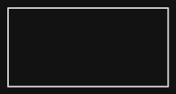
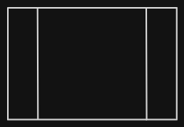
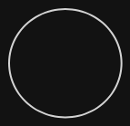
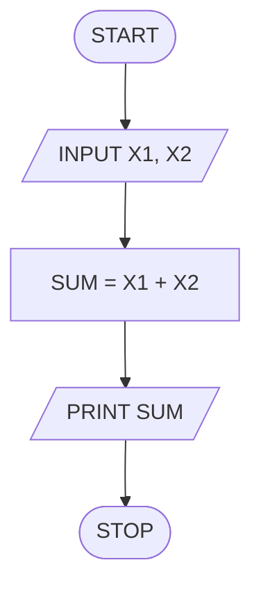
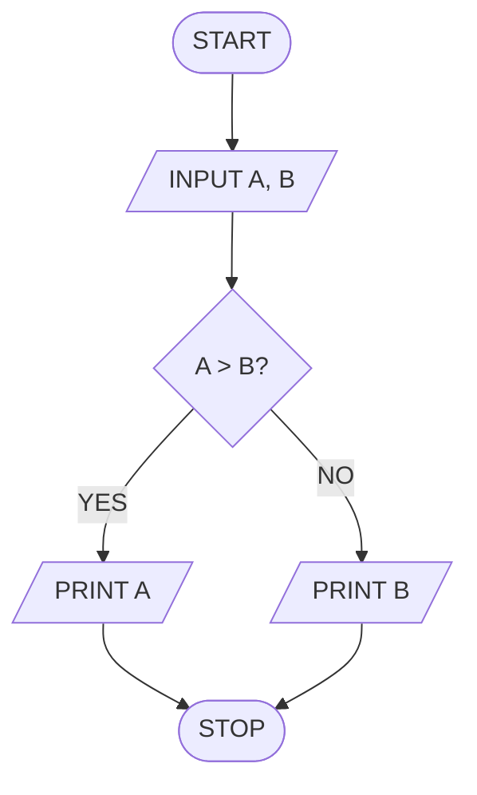
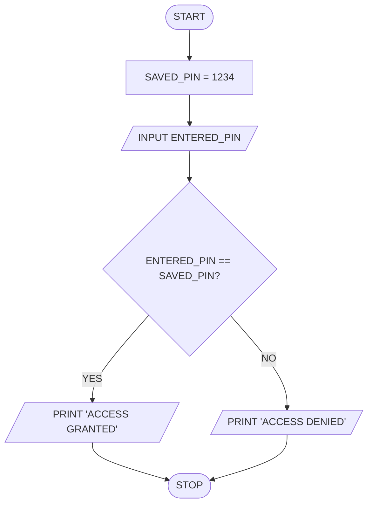
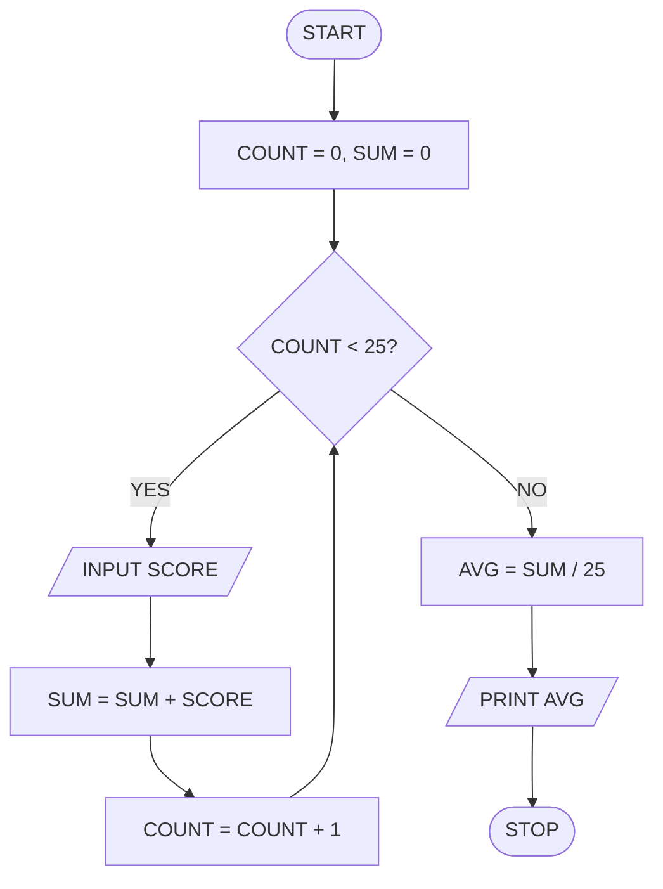

# Introduction to Programming: Flowcharts

## Key Terminologies
1. **Flowchart**: A diagrammatic representation of the sequence of operations in a computer program or process.
2. **Terminal**: The symbol used to indicate the beginning (START) and end (STOP) of a process.
3. **Decision**: A symbol used to represent a branching point where a condition is tested (Yes/No).
4. **Sequence**: The chronological order in which steps are performed.

---

## 1. Flowchart Fundamentals
> [!abstract] Flowchart
> A flowchart is a diagram that represents the flow of data through processing systems. It provides a visual overview of the operations performed and the sequence in which they occur.

### Flowchart Symbols
Standardized symbols are used to ensure that flowcharts can be understood by anyone.

| Name                   | Symbol                                         | Description                                               |
| :--------------------- | :--------------------------------------------- | :-------------------------------------------------------- |
| **Terminal**           |            | Indicates the start or end of the process.                |
| **Process**            |             | Represents a calculation or data manipulation.            |
| **Input/Output**       |        | Represents data entry (INPUT) or display (PRINT).         |
| **Decision**           |            | A logic test that results in two possible paths (Yes/No). |
| **Predefined Process** |  | Represents a sub-routine or a named process.              |
| **Connector**          |           | Used to join different parts of a flowchart.              |
| **Flow Lines**         |          | Shows the direction of the process flow.                  |

---

## 2. General Rules for Flowcharts
To maintain clarity and consistency, follow these standard conventions:
1.  **Flow Direction**: Processes should generally flow from top to bottom or left to right.
2.  **Connection**: All boxes must be connected with arrows (flow lines).
3.  **Entry Points**: Symbols should have an entry point exclusively at the top.
4.  **Exit Points**: Most symbols have one exit point at the bottom, except for the **Decision** symbol, which has exactly two (True/False).

---

## 3. Examples and Applications

### Example 1: Area of a Circle
**Problem**: Calculate the area of a circle given its radius `r`.

> [!example] Algorithm & Flowchart
> **Algorithm**:
>```text
> STEP 1: START
> STEP 2: INPUT r
> STEP 3: AREA = PI * r * r
> STEP 4: PRINT AREA
> STEP 5: STOP
>    ```
>
> **Flowchart**:
> ```mermaid
> graph TD
>     A([START]) --> B[/INPUT r/]
>     B --> C[AREA = PI * r * r]
>     C --> D[/PRINT AREA/]
>     D --> E([STOP])
> ```

### Example 2: Temperature Conversion
**Problem**: Convert Fahrenheit to Celsius.

> [!example] Algorithm & Flowchart
> **Algorithm**:
> ```text
> STEP 1: START
> STEP 2: INPUT Fahrenheit (F)
> STEP 3: Celsius (C) = (F - 32) * 5/9
> STEP 4: PRINT C
> STEP 5: STOP
> ```
>
> **Flowchart**:
> ```mermaid
> graph TD
>     Start([START]) --> In[/INPUT F/]
>     In --> Calc[C = F - 32 * 5/9]
>     Calc --> Out[/PRINT C/]
>     Out --> Stop([STOP])
> ```

---

## 4. Practice Problems

### 1. Add Two Numbers


### 2. Greater of Two Numbers


### 3. ATM Pin Authentication


### 4. Average of 25 Scores

