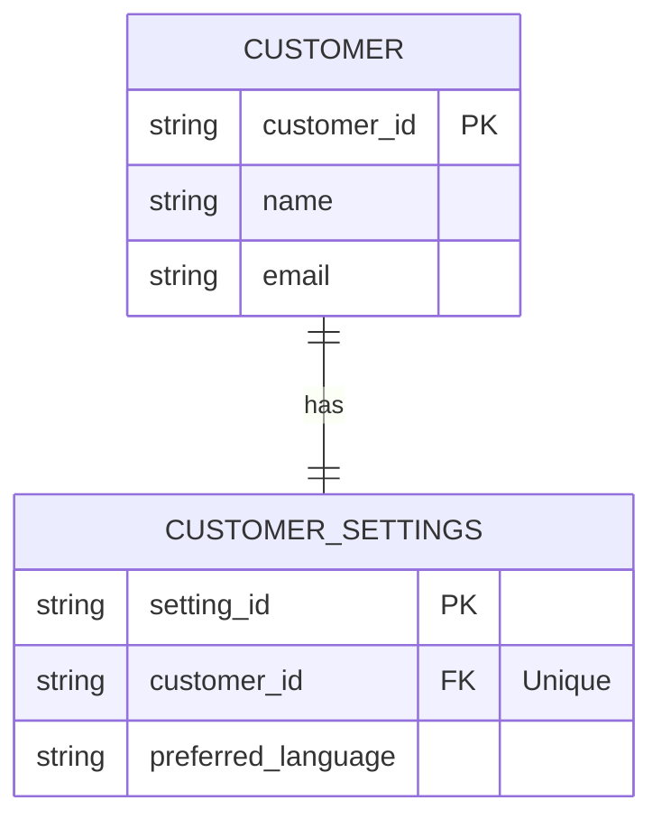
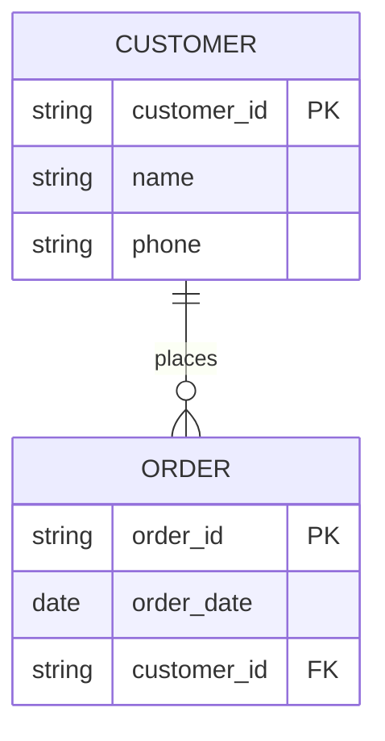
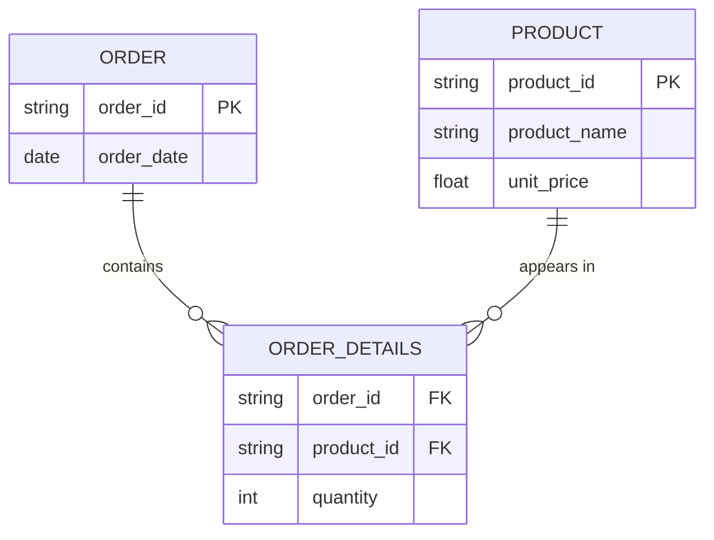

# Principles of Database Systems: Introduction

## Key Terminologies
1. System
2. Computer Systems
3. Hardware
4. Software/Programs
5. Data Processing
6. Information
7. Entity
8. Attribute/Field
9. Primary Key
10. Foreign Key
11. Record
12. File/Relation/Table
13. Database
14. DBMS

---

## 1. System Fundamentals
> [!abstract] System
> The integration of different but related components working together to achieve a specific objective.

### Characteristics of a System
- **Central Objective**: Every system must have a clear purpose.
- **Minimum Components**: Consists of at least two related components.
- **Interdependence**: There is a necessary interaction between the system components to function correctly.

### Examples of Systems
- **Computer Systems**
- **Information Systems (IS)**: e.g., a Database System.
- **Database Management Systems (DBMS)**

## 2. Computer Systems
> [!info] Computer System
> An electronic device consisting of end users, hardware, and software that converts data into useful information.

- **Hardware**: The physical, tangible components of a computer and database system.
- **Software**: The set of instructions that tells the hardware components what to do and how to do it.

## 3. Data and Information
> [!important] Data Processing
> The conversion of raw facts (**Data**) into useful results (**Information**).

- **Data**: Raw facts that are meaningless to the end user in their isolated state.
- **Information**: Processed data that has context and is useful to the end user.

## 4. The Data Hierarchy
Understanding how data builds from simple attributes to complex databases:

1.  **Entity**: A subject or an object about which information can be stored (e.g., Student, Product).
2.  **Attribute / Field**: Characteristics used to describe an entity (e.g., Name, Age).
3.  **Record (Tuple)**: A collection of different but related attributes representing a single instance.
4.  **File (Relation/Table)**: A collection of related records organized into rows and columns.
5.  **Database**: A collection of related files stored at a centralized location.

### Entity Examples
| Entity | Attributes |
| :--- | :--- |
| **Student** | StudentID (pk), firstname, surname, phone_number, D.O.B, Sex |
| **Course** | CourseID (pk), CourseName, Credits, Department, Duration |
| **Lecturer** | LecturerID (pk), Firstname, Surname, Email, Department, Office |
| **Order** | OrderID (pk), OrderDate, CustomerID, TotalAmount, Status |
| **Product** | ProductID (pk), ProductName, Category, UnitPrice, StockLevel |
| **Patient** | PatientID (pk), Firstname, Surname, D.O.B, BloodGroup, Address |
*(pk = Primary Key)*

### Database File Example (Student File)
This diagram shows the relationship between Attributes, Tuples (Records), and the File.

```text
FILE: Student File (Relation)
+-------------------------------------------------------------+
| student_id (pk) |    surname     |      DOB      |  <----------- ATTRIBUTES (Fields)
+=================+================+===============+
|      S001       |     Mwangi     |  2002-05-14   |  <----------- TUPLE (Record)
+-----------------+----------------+---------------+
|      S002       |     Adhiambo   |  2003-11-20   |  <----------- TUPLE (Record)
+-----------------+----------------+---------------+
|      S003       |     Kiprop     |  2001-02-03   |  <----------- TUPLE (Record)
+-----------------+----------------+---------------+
```

### Key Identifiers
- **Primary Key**: A unique identifier for an entity.
- **Foreign Key**: A field in one table that links to the primary key of another entity.

---

## 5. Database Relationships
Relationships define how records in one table relate to records in another.

### 1) One-to-One (1:1)
- **Definition**: Each record in Table A is linked to exactly one record in Table B, and vice versa.
- **Example**: A **User** and a **User Profile**. One user has one profile; one profile belongs to one user.
- **Data Structure**: Usually implemented by placing a Foreign Key in one table with a `UNIQUE` constraint.


**Showcase: Customer and CustomerSettings**


### 2) One-to-Many (1:N)
- **Definition**: A single record in Table A can relate to multiple records in Table B, but a record in Table B relates to only one in Table A.
- **Example**: A **Department** and its **Employees**. One department has many employees; each employee belongs to one department.
- **Data Structure**: The "Many" side (Employees) contains a Foreign Key referencing the Primary Key of the "One" side (Department).

**Showcase: Customer and Order**


### 3) Many-to-Many (M:N)
- **Definition**: Multiple records in Table A can relate to multiple records in Table B.
- **Example**: **Students** and **Courses**. A student can enroll in many courses; a course can have many students.
- **Data Structure**: Requires a **Junction Table** (Associative Table) containing Foreign Keys for both related tables.

**Showcase: Order and Product**


### Validation Rules for Referential Integrity
To maintain data consistency, databases enforce **Foreign Key Constraints**:
1.  **Existence**: A foreign key value must exist as a primary key in the parent table before it can be used in the child table.
2.  **On Delete Restrict**: Prevents deleting a parent record if child records still reference it.
3.  **On Delete Cascade**: Automatically deletes all related child records when the parent record is deleted.
4.  **Update Integrity**: If a Primary Key is updated, all associated Foreign Keys must be updated accordingly to prevent "orphan" records.

Test image
![[Pasted image 20260212095445.png]]